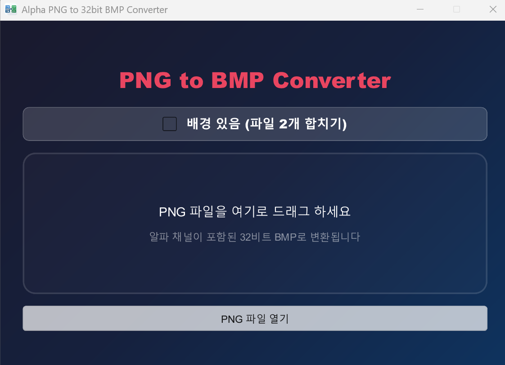
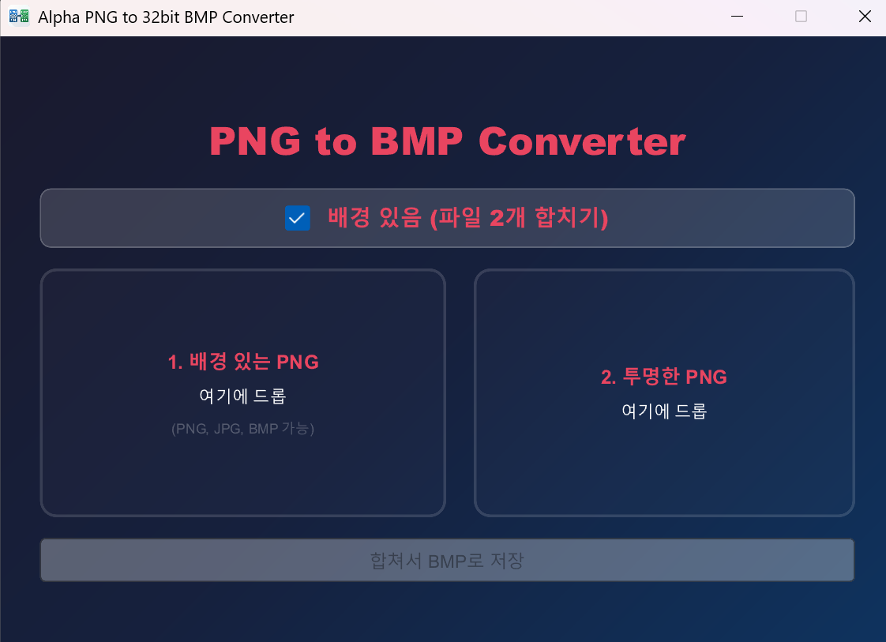

# Alpha PNG to 32-bit BMP Converter (Koei FaceTool 호환)

이 프로그램은 배경이 투명한 PNG 파일을 **코에이(Koei) 삼국지 FaceTool** 및 구형 게임 엔진에서 완벽하게 인식하는 **알파 채널 포함 32비트 BMP**로 변환해주는 도구입니다.

## 📸 미리보기

| 단일 모드 | 배경 결합 모드 |
| :---: | :---: |
|  |  |

## ✨ 주요 기능

- **알파 채널 결합 (배경 있음 기능)**:
  - 배경이 이미 채워진 이미지(PNG, JPG, BMP)와 투명도가 포함된 이미지(PNG)를 각각 드롭하여 결합할 수 있습니다.
  - 별도의 포토샵 작업 없이 두 파일을 합쳐서 알파 채널이 포함된 32비트 BMP를 즉시 생성합니다.
- **이미지 미리보기**: 드래그 앤 드롭 시 앱 내에서 실시간으로 이미지를 미리 확인할 수 있습니다.
- **다양한 포맷 지원**: 배경 소스로 PNG 뿐만 아니라 JPG, BMP 파일을 지원합니다. (결합 모드 한정)
- **Koei FaceTool 최적화**: 
  - 표준 40바이트 `BITMAPINFOHEADER` 사용.
  - 고전적인 **Bottom-Up**(하단부터 기록) 픽셀 정렬 방식 적용.
  - 구형 툴에서 발생하는 "지원하지 않는 형식" 오류 해결.
- **드래그 앤 드롭 (Drag & Drop)**: 탐색기에서 파일을 창으로 끌어다 놓기만 하면 즉시 변환됩니다. (Windows Hook 및 드롭 좌표 판별 로직 적용)
- **깔끔한 GUI**: Slint 프레임워크를 사용하였으며, 릴리즈 모드 실행 시 콘솔 창이 나타나지 않는 깔끔한 환경을 제공합니다.

## 🚀 다운로드

최신 실행 파일은 **[GitHub Releases](https://github.com/kirinonakar/rust_bmp/releases)** 페이지에서 다운로드할 수 있습니다.

## 🛠 개발 환경 및 실행 요구 사항

### 사전 요구 사항

- [Rust](https://www.rust-lang.org/tools/install) (버전 1.70 이상 권장)
- Windows OS (드래그 앤 드롭 기능은 Windows 전용으로 최적화되어 있습니다)

### 설치 및 실행

1. 저장소를 클론합니다.
   ```bash
   git clone https://github.com/your-username/rust_bmp.git
   cd rust_bmp
   ```

2. 프로그램을 빌드하고 실행합니다.
   ```bash
   cargo run --release
   ```

## 🛠 사용 방법

### 단일 파일 변환 (Single Mode)
1. 프로그램을 실행합니다. (배경 있음 체크 해제 상태)
2. 변환하고 싶은 **투명 배경 PNG** 파일을 창으로 **드래그 앤 드롭**합니다.
3. 원본 파일과 같은 폴더에 알파 채널이 포함된 `.bmp` 파일이 자동 생성됩니다.

### 배경 포함 결합 (Combined Mode)
1. **배경 있음 (파일 2개 합치기)** 체크박스를 선택합니다.
2. **왼쪽 박스**에 배경이 있는 이미지(PNG, JPG, BMP)를 드롭합니다.
3. **오른쪽 박스**에 투명도가 포함된 이미지(PNG)를 드롭합니다.
4. 하단의 **합쳐서 BMP로 저장** 버튼을 클릭하여 결과물을 생성합니다.

## 📦 기술 스택

- **Language**: Rust
- **UI Framework**: [Slint](https://slint.dev/)
- **Image library**: `image` crate
- **Windows API**: `windows-sys` (Win32 API Hooking & Subclassing)

## 📝 라이선스

이 프로젝트는 MIT 라이선스 하에 배포됩니다. 자유롭게 수정 및 배포가 가능합니다.

---
**Note**: 포토샵에서 수동으로 채널 작업을 할 필요 없이, 단일 파일 변환이나 두 파일 결합을 통해 바로 게임에 적용 가능한 BMP를 만들어줍니다.
